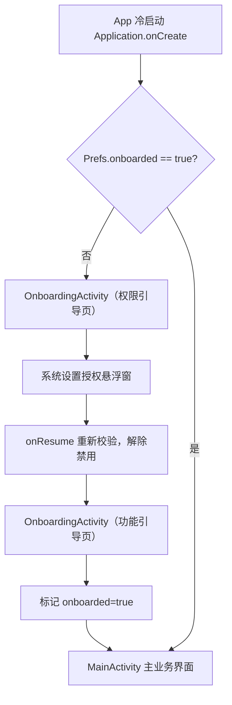
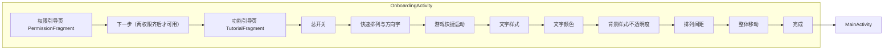

# 首次启动新手向导

Feature Name: first-run-onboarding
Updated: 2026-08-14

## Description

应用首次冷启动时，通过独立的 OnboardingActivity 展示「权限引导 + 功能引导」两步向导。第一步完成悬浮窗权限授权校验（读取应用列表权限为安装时自动授予的普通权限，仅作信息展示），第二步按固定顺序分步介绍应用核心功能，全部结束后进入 MainActivity。引导完成状态持久化到 SharedPreferences，后续启动直接进入主界面。

## Architecture

## Components and Interfaces

### OnboardingActivity（新）

- **职责**: 承载两步引导流程，横屏锁定（与主界面一致）
- **页面切换**: 权限引导页 → 功能引导页，用 ViewPager2 + 2 个 Fragment，或单 Activity 内直接替换子 View（本项目无 ViewPager 依赖，倾向轻量方案）
- **入口**: Application 冷启动时检查 `Prefs.onboarded`，未完成则 `startActivity(OnboardingActivity)` 并 `finish()` 原 MainActivity 启动意图
- **出口**: 引导完成后写 `Prefs.onboarded = true`，`startActivity(MainActivity)` + `finish()`

### 权限引导页（PermissionFragment）

| 元素 | 说明 |
|------|------|
| 悬浮窗权限条目 | 显示状态；点击跳转 `Settings.ACTION_MANAGE_OVERLAY_PERMISSION`；状态用 `Settings.canDrawOverlays()` 实时校验 |
| 读取应用列表权限条目 | QUERY_ALL_PACKAGES 安装时已授予，恒显示「已授权」，仅信息展示，无申请入口 |
| 下一步按钮 | 两权限全授（实际仅悬浮窗）才可用，否则置灰 |

### 功能引导页（TutorialFragment）

- 横向分页或竖向滚动卡片，按固定顺序 8 步：
  1. 总开关 2. 快速排列与方向字 3. 游戏快捷启动 4. 文字样式 5. 文字颜色 6. 背景样式/背景不透明度 7. 排列间距 8. 整体移动
- 每步配插图/示意图 + 说明文案 + 「上一步/下一步/完成」导航

### Prefs（改）

- 新增 `onboarded: Boolean`（默认 false），`sp.getBoolean("onboarded", false)`

### AndroidManifest（改）

- 新增 OnboardingActivity，`screenOrientation="landscape"`、`exported="true"`（应用入口，MainActivity 保留为 launcher，Onboarding 由代码启动）
- 保留现有 `<queries>` 声明

## Data Models

| 字段 | 类型 | 默认 | 说明 |
|------|------|------|------|
| `onboarded` | Boolean | false | 新手引导是否已完成，持久化于 SharedPreferences |

## Correctness Properties

- OnboardingActivity 在权限页时，仅当 `Settings.canDrawOverlays(this)` 为 true 才允许进入功能引导页
- 引导完成标记写入后，任何后续冷启动均不再进入 OnboardingActivity
- 悬浮窗权限状态在 onResume 时重新校验（用户从系统设置返回），不依赖轮询线程
- 权限申请跳转目标使用 `package:$packageName` URI，避免申请到错误应用的权限

## Error Handling

| 场景 | 处理 |
|------|------|
| 用户拒绝悬浮窗权限 | 保持未授权，下一步禁用，允许再次点击条目重新申请 |
| 用户永久拒绝悬浮窗权限 | 无法再次拉起系统弹窗；条目提示「需前往系统设置手动开启」，点击仍跳转系统设置页 |
| 跳转系统设置 Activity 失败（无对应 Activity） | try/catch 捕获，Toast 提示，页面不崩溃 |
| Application 冷启动时 onSharedPreferenceChanged 等异常 | 兜底，直接放行进入 MainActivity，不阻塞主流程 |
| 权限状态校验调用 | 仅在 onResume / 点击时同步执行，不建轮询线程，避免主线程阻塞 |

## Test Strategy

- 单元测试：
  - `Prefs.onboarded` 读写默认值（首次 false）
  - 引导完成标记持久化后不再触发（模拟二次冷启动）
- 仪器化/人工验证清单：
  1. 全新安装首次启动进入权限引导页，下一步禁用
  2. 授权悬浮窗后返回，下一步自动启用
  3. 拒绝权限，下一步保持禁用
  4. 永久拒绝后出现「前往系统设置」提示
  5. 完成功能引导后进入主界面，杀掉进程重开直接进主界面
  6. 横屏下布局正常，无按钮遮挡

## References

[^1]: (Android Docs) - [System Alert Window](https://developer.android.com/reference/android/provider/Settings#ACTION_MANAGE_OVERLAY_PERMISSION)
[^2]: (Android Docs) - [QUERY_ALL_PACKAGES](https://developer.android.com/reference/android/Manifest.permission#QUERY_ALL_PACKAGES)
