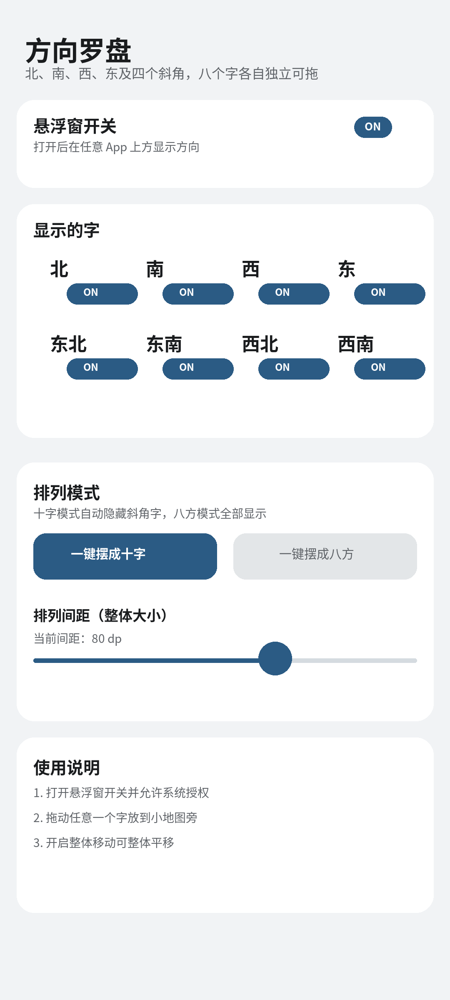

<div align="center">

# 方向罗盘 CompassOverlay

**Android 全局悬浮方向文字工具 · 专为游戏小地图设计**

一个悬浮窗小工具，在屏幕任意位置显示「上北下南 左西右东」八个方向字，可自由拖拽、整体移动、实时调整间距。静态方位，无传感器漂移。

**CompassOverlay is an Android floating-window compass tool that pins the eight directions (North / South / West / East / NE / NW / SE / SW) on top of any game, with drag-and-drop positioning and adjustable spacing.**

[English](#english) · [中文](#chinese)

</div>

---

## 中文（Chinese）

### 开发初衷

这是我发布的**第一个开源项目**。

起因是玩游戏时经常在小地图里迷路：原神这类游戏的小地图在室内、地牢或探索区域往往不显示方位，靠记忆和观察完全分不清东西南北。市面上的指南针 App 大多依赖传感器，在室内/洞穴/高速移动场景容易漂移、抖动，而且很多是带广告的商业应用。

于是我自己写了一个：**用纯静态的方位文字悬浮窗**，上北下南、左西右东，永远不会漂移，永远指得对。开发过程中经历了遮挡、文字裁剪、拖动不跟手、单字拖动变整体移动等一堆 bug，一点点修到了现在。把它开源出来，希望能帮到有同样需求的人，也请各位前辈多多指教。

### 功能特性

- **八方向显示**：上北、下南、左西、右东、东北、东南、西北、西南，与原神小地图方位一致
- **十字 / 八方双模式**：十字模式自动隐藏四斜角字、界面更清爽；八方模式全部显示
- **自由拖拽**：长按单个方向字可单独拖动，默认开启「整体移动」后拖任一字可整体平移，松手自动保存位置
- **间距实时可调**：滑块调整字间距，松手自动按中心缩放并保留手动拖过的位置
- **字号 / 颜色 / 背景可调**：字号 12~40sp、7 种预设颜色、可选深色圆角背景及背景不透明度
- **刷新率自适应**：自动识别手机/平板刷新率（60/120/144Hz 等）调整更新频率，锚点字每帧跟手、其余字按比例节流，占用低
- **不拦截触摸**：每个方向字独立小窗，空白区域不遮挡触摸，游戏操作不受影响
- **屏幕适配**：横竖屏切换自动夹回屏幕内，平板 / 手机自适应默认间距与字号
- **自动更新检查**：启动时静默检查新版本，可提示或强制更新

### 演示截图

> 截图占位：请将你的设置界面截图与游戏内悬浮效果图分别命名为 `screenshots/settings.png`、`screenshots/game.png` 放入本仓库 `screenshots/` 目录后展示。




### 安装使用

#### 方式一：下载成品 APK（推荐）

1. 前往 [Releases](https://github.com/kkxxdbx/compass-overlay/releases) 下载最新的 `app-release.apk`
2. 手机上点击安装；若提示「未知来源」，允许后继续
3. 首次打开点击「悬浮窗开关」，在弹出的系统授权中允许「显示在其他应用上层」
4. 回到游戏，把方向罗盘拖到小地图旁边即可

> 也可直接访问在线下载页：https://8080-79eaae0f5c7dd70e.monkeycode-ai.online

#### 方式二：源码本地编译

需要 JDK 17 + Android SDK（compileSdk 34）。直接用 Android Studio 打开本目录即可构建。

```bash
# 生成 debug 包（app/build/outputs/apk/debug/）
./gradlew assembleDebug

# 生成 release 包（app/build/outputs/apk/release/）
./gradlew assembleRelease
```

### 权限说明

| 权限 | 用途 |
|------|------|
| 显示在其他应用上层（SYSTEM_ALERT_WINDOW） | 悬浮窗常驻显示的唯一必需权限 |
| 前台服务（FOREGROUND_SERVICE） | 维持悬浮窗后台常驻 |
| 网络（INTERNET） | 仅启动时静默查询一次更新信息（version.json），**不上传任何数据** |

**不收集任何用户数据，无广告，无埋点，无任何形式的隐私采集。**

### 风险提示

- 本工具仅供**单机游戏**或个人使用，请勿在存在反作弊系统的联机网游中使用
- 部分网游（含原神）可能对「悬浮窗 / 屏幕覆盖层」存在检测策略，使用可能导致账号风险，**后果请自行评估承担**
- 作者不对使用本工具产生的任何账号封禁或损失负责

### 项目结构

```
app/src/main/java/com/compassoverlay/
├── MainActivity.kt        设置页
├── OverlayService.kt      前台服务 + 悬浮窗多窗口管理 + 帧合并拖动
├── CompassOverlayView.kt  方向字视图（拖拽手势、共享背景）
├── Prefs.kt               设置存取（SharedPreferences 封装）
├── UpdateChecker.kt       启动时静默检查新版本
└── App.kt                 应用入口
```

### 环境依赖

- Android Studio（推荐最新稳定版）
- JDK 17
- Android SDK：compileSdk 34 / targetSdk 34 / minSdk 26
- Kotlin + 原生 View（无第三方运行时依赖）

### 开源协议

本项目以 [MIT](./LICENSE) 协议开源，可自由使用、修改、二次分发，欢迎二次开发。

---

### Star / Fork / PR / Issue

如果你觉得有用，欢迎：

- ⭐ **Star**：让更多需要的人看到
- 🍴 **Fork / PR**：提功能、修 bug，一起把项目做好
- 🐛 **Issue**：反馈问题或提出建议，我会尽力跟进

提交 PR 前请阅读 [CONTRIBUTING.md](./CONTRIBUTING.md)。

---

## English

### Introduction

**CompassOverlay** is an Android floating-window compass tool that shows the eight cardinal directions (North / South / West / East / NE / NW / SE / SW) as static text on top of any app. It was originally built for games like *Genshin Impact*, whose in-game minimap often hides the heading indoors, in dungeons, or in the open world — and sensor-based compass apps drift and jitter.

Instead of relying on sensors, the compass uses a **static fixed orientation** (North = up). It never drifts. Features:

- 8 direction labels with a clean cross-mode (4 diagonal labels auto-hidden)
- Drag any label individually, or move the whole compass with one gesture
- Adjustable spacing, font size (12–40sp), 7 preset colors, optional dark rounded background
- Refresh-rate adaptive updates (60 / 120 / 144 Hz) for low overhead
- Independent per-label windows: no touch blocking, no clipping
- Auto-update check on launch

### Installation

1. Download `app-release.apk` from [Releases](https://github.com/kkxxdbx/compass-overlay/releases)
2. Install and allow the "Display over other apps" permission
3. Drag the compass next to your game's minimap

### Build

Requires JDK 17 + Android SDK (compileSdk 34). Open the folder in Android Studio, or:

```bash
./gradlew assembleDebug   # debug APK
./gradlew assembleRelease # release APK
```

### Permissions & Privacy

- **Display over other apps** — the only required permission for the overlay
- Foreground service — keeps the overlay alive
- Internet — used only to check for updates once on launch; **no data is collected or uploaded**

### Risk

This tool is intended for **single-player / personal use**. Online games with anti-cheat systems may detect overlay windows — use at your own risk. The author assumes no liability for any account consequences.

### License

[MIT](./LICENSE). Free to use, modify and redistribute.
